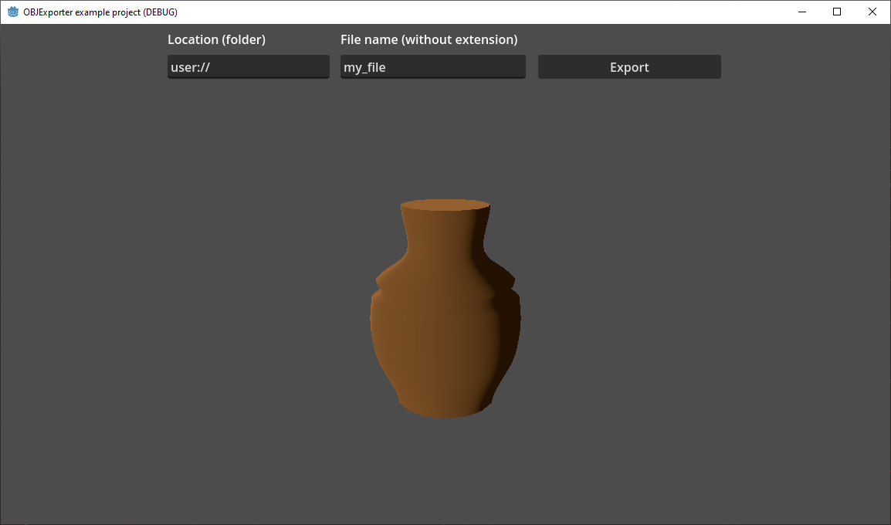
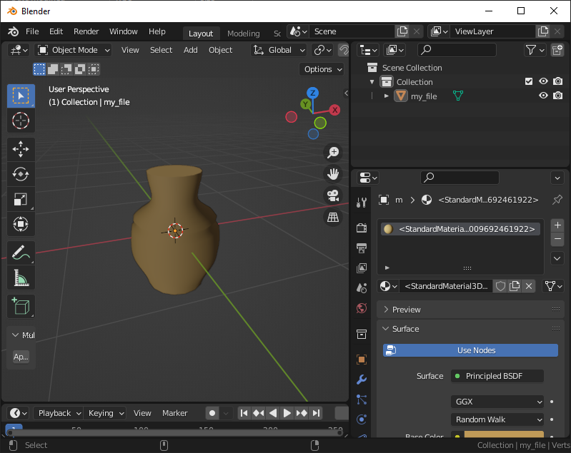

# OBJExporter Plugin for Godot 4.x

Godot plugin to export meshes as OBJ (`.obj`, `.mtl`) from games and apps during runtime. Does not use any editor-only classes, and is pure GDScript (not requiring mono version nor any GDExtension shenanigans).

Based on the work of mohammedzero43's [CGSExporter](https://github.com/mohammedzero43/CSGExport-Godot) and fractilegames's [godot-obj-export](https://github.com/fractilegames/godot-obj-export).

----

## How To Use

Install the plugin, activate it. This will make the `OBJExporter` singleton available to your game/app.

To save a mesh to a `.obj`/`.mtl` file pair, call:

```gdscript
OBJExporter.save_mesh_to_files(mesh, file_path, file_name_without_extension)
```

So if you want to save the mesh in a `my_meshinstance3d` node into `user://model/my_file.obj` and `user://model/my_file.mtl`, use:

```gdscript
OBJExporter.save_mesh_to_files($my_meshinstance3d.mesh, "user://model/", "my_file")
```

_Important: the `file_path` must exist, so check and create it with `DirAccess` first, if needed._


### Signals

Depending on model complexity, the file generation might take a good while, so it happens asynchronously. **_Does not use threads_**, instead it relies on `await` to run in the background in the main thread. 

Therefore, the `OBJExporter` singleton has 3 signals to inform your application:

* `export_started`: 

Emitted when `save_mesh_to_files()` is called


* `export_progress_updated(surf_idx, progress_value)`: 

Emitted periodically during file generation (every 60 vertices), to be used to update progress bars and similar. Arguments are surface index (starting at `0`) and a normalized progress value (that is, range from `0.0` to `1.0`) _of that surface_. There is no argument for overall progress value as calculating this would be unnecessarily costly.


  * `export_completed(object_file, material_file)`:
  
Emitted when the process is completed and the files are saved to disk. The arguments are the final filenames used (e.g. `user://model/my_file.obj` and `user://model/my_file.mtl`), composed from the input arguments.


Since `OBJExporter` is a singleton and therefore not visible in your scene tree in the editor, connect these signals via code (if used), e.g.:

```gdscript
func _ready():
	OBJExporter.export_started.connect(_on_export_started)
	OBJExporter.export_completed.connect(_on_export_completed)
	OBJExporter.export_progress_updated.connect(_on_export_progress)
```

----

## Included Example Project

Included in the repo is an example project which exports the built-in mesh from a `MeshInstance3D` node.




The exported `.obj`/`.mtl`, later imported into Blender:


